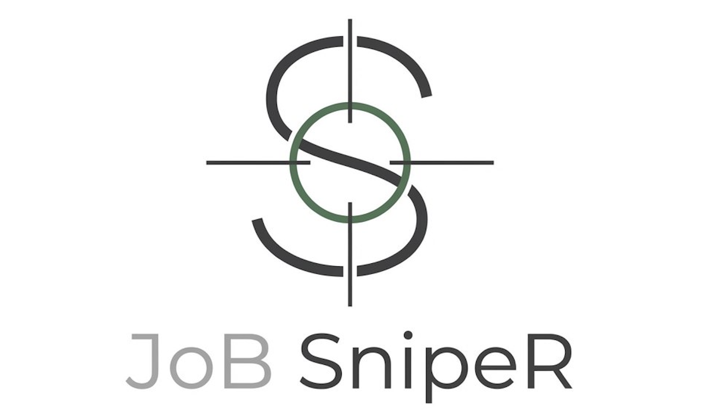

<div align="center">
  
  
  # JobSniper 🎯
  
  **Production-ready automated job monitoring system with AI-powered CV matching analysis.**
</div>

JobSniper is an advanced, high-precision tool designed for automated job hunting across multiple job boards including **Just Join IT**, **RemoteOK**, **Remotive**, **Arbeitnow**, and **WeWorkRemotely**. Unlike traditional job alerts that only filter by basic keywords or locations, JobSniper uses **LLM-based Artificial Intelligence** (OpenAI GPT-4o-mini) to deeply understand the context of your professional background.

By parsing your uploaded **CV (PDF)**, the bot acts as a personal headhunter that works 24/7. It reads thousands of job descriptions, extracts technical requirements, and compares them against your specific experience, scoring every match from 0 to 100%. When it finds a high-quality match that exceeds your defined threshold, it sends you an instant rich-media notification via Telegram, including a detailed justification of why the offer is worth your attention.

## ✨ Key Features

- **🧠 Intelligent Matchmaking**: Beyond simple keywords. The AI understands nuances in tech stacks, seniority levels, and domain experience.
- **📱 Interactive Telegram Control Panel**: Full-featured UI for managing filters, CV, and triggering searches
- **🌍 Multi-Source Support**: Just Join IT, RemoteOK, Remotive, Arbeitnow, WeWorkRemotely
- **⚡ Real-time Notifications**: Instant Telegram alerts for high-match offers
- **📊 Production Monitoring**: Prometheus metrics, Grafana dashboards, health checks
- **🛡️ Resilience**: Circuit breaker for API protection, graceful error handling
- **🔒 Production Hardening**: Resource limits, security, logging, health checks

## 🏗️ Architecture

### Tech Stack

- **Python 3.11** with async/await
- **SQLAlchemy 2.0** + **AsyncPG** for database
- **OpenAI GPT-4o-mini** for AI matching
- **Telegram Bot API** for notifications
- **Redis** for caching AI results
- **Prometheus + Grafana** for monitoring
- **Docker Compose** for orchestration

### Project Structure

```
JobSniper/
├── core/                      # Core utilities
│   ├── config.py             # Settings management (Pydantic)
│   ├── database.py           # Database manager (AsyncPG + SQLAlchemy 2.0)
│   ├── logger.py             # Central logging
│   └── circuit_breaker.py    # OpenAI API circuit breaker
├── models/                    # Database models
│   └── models.py             # SQLAlchemy 2.0 models
├── services/                  # Business services
│   ├── fetcher.py            # Just Join IT API fetcher
│   ├── foreign_fetcher.py   # International job boards (RemoteOK, Remotive, etc.)
│   ├── storage.py            # Database operations
│   ├── matcher.py            # AI analysis (OpenAI + CV parsing)
│   └── notification.py       # Telegram notifications
├── health_server.py          # Health check HTTP server
├── prometheus_exporter.py    # Prometheus metrics exporter
├── main.py                   # Main orchestrator
├── docker-compose.yml        # Full stack (app, db, redis, monitoring)
├── Dockerfile                # Application image
└── requirements.txt          # Python dependencies
```

## 🚀 Quick Start

### Prerequisites

- **Docker & Docker Compose** (required - application runs in containers)
- OpenAI API key
- Telegram Bot (token + chat ID)

> **Note:** This project is containerized using Docker. All services (application, database, Redis, monitoring) run in Docker containers for easy deployment and isolation.

### Installation

1. **Clone the repository**
   ```bash
   git clone <your-repo-url>
   cd JobSniper
   ```

2. **Configure environment**
   ```bash
   cp .env.example .env
   # Edit .env and add your API keys
   ```

3. **Add your CV**
   ```bash
   mkdir -p data
   cp /path/to/your/cv.pdf data/cv.pdf
   ```

4. **Start the application with Docker**
   ```bash
   docker-compose up -d
   ```
   
   This will start all services in containers:
   - Application (JobSniper bot)
   - PostgreSQL database
   - Redis cache
   - Prometheus (monitoring)
   - Grafana (dashboards)
   - Prometheus exporter

5. **Check status**
   ```bash
   # Health check
   curl http://localhost:8080/health
   
   # View logs
   docker-compose logs -f app
   ```

## 📊 Monitoring

### Health Checks

- **Main endpoint**: `http://localhost:8080/health`
- **Database**: `http://localhost:8080/health/db`
- **Redis**: `http://localhost:8080/health/redis`
- **Readiness**: `http://localhost:8080/readiness`
- **Liveness**: `http://localhost:8080/liveness`

### Prometheus & Grafana

The project includes full monitoring stack:

- **Prometheus**: `http://localhost:9090`
- **Grafana**: `http://localhost:3001` (admin/admin)
- **Metrics Exporter**: `http://localhost:9092/metrics`

Available metrics:
- `jobsniper_health_status` - Overall health (1=healthy, 0.5=degraded, 0=unhealthy)
- `jobsniper_response_time_ms` - Component response times (database, redis)
- `jobsniper_circuit_breaker_state` - OpenAI API circuit breaker state (1=closed, 0.5=half_open, 0=open)
- `jobsniper_uptime_seconds` - Application uptime
- `jobsniper_component_status` - Individual component status (database, redis, cv, application)

## 🎮 Telegram Control Panel

Type `/menu` or `/start` in Telegram to access:

- **🚀 SEARCH NOW**: Trigger immediate scan
- **🛑 STOP SEARCH**: Stop automatic scanning
- **📊 Statistics**: View performance metrics
- **📂 My CV**: View, upload, or delete CV
- **🌐 Sources**: Enable/disable job boards (Just Join IT, RemoteOK, Remotive, Arbeitnow, WeWorkRemotely)
- **🌍 Cities**: Set preferred locations
- **🏠 Remote**: Toggle remote-only filter
- **🎯 Threshold**: Adjust AI strictness (0-100)
- **🔍 Keywords**: Update search keywords
- **📁 Category IDs**: Change Just Join IT category IDs
- **⚙️ Match Mode**: Set keyword matching mode (Relaxed/Moderate/Strict)

## ⚙️ Configuration

### Environment Variables

| Variable | Description | Default |
|----------|-------------|---------|
| `OPENAI_API_KEY` | OpenAI API key | **Required** |
| `TELEGRAM_BOT_TOKEN` | Telegram bot token | **Required** |
| `TELEGRAM_CHAT_ID` | Telegram chat ID | **Required** |
| `POSTGRES_PASSWORD` | Database password | **Required** |
| `JJIT_FETCH_INTERVAL` | Check frequency (seconds) | 300 |
| `MATCH_THRESHOLD` | Minimum score for notification | 80 |
| `OPENAI_MODEL` | OpenAI model | gpt-4o-mini |
| `REDIS_ENABLED` | Enable Redis caching | true |

### Dynamic Configuration (via Telegram)

All filters can be changed at runtime via Telegram menu - no restart required!

**Available settings:**
- **Job Sources**: Enable/disable specific job boards
- **Locations**: Comma-separated list of cities
- **Remote Filter**: Toggle remote-only offers
- **Keywords**: Search terms (comma-separated)
- **Category IDs**: Just Join IT categories (e.g., 5=Python, 1=JavaScript)
- **Match Threshold**: Minimum AI score (0-100)
- **Keyword Match Mode**: 
  - **Relaxed**: Matches if any keyword found (60% threshold)
  - **Moderate**: Matches if most keywords found (80% threshold)
  - **Strict**: Matches only if all keywords found (100% threshold)
- **Auto-scan**: Enable/disable automatic background scanning

## 🛠️ Development

### Local Setup

```bash
# Install dependencies
pip install -r requirements.txt

# Set environment variables
export $(cat .env | xargs)

# Run
python main.py
```

### Testing

```bash
# Run tests
pytest

# Run with coverage
pytest --cov=. --cov-report=html
```

### Database Management

```bash
# Connect to PostgreSQL
docker-compose exec db psql -U jobsniper -d jobsniper_db

# Check offers
SELECT id, title, company_name, match_score, notified 
FROM job_offers 
ORDER BY match_score DESC 
LIMIT 10;
```

## 🔒 Security Features

- **Non-root Docker user**: Application runs as non-privileged user
- **Resource limits**: CPU and memory limits for all containers
- **Network security**: Database and Redis only accessible from Docker network
- **Health checks**: Automatic container health monitoring
- **Log rotation**: Automatic log file rotation
- **Circuit breaker**: Protection against API failures

## 📁 Project Structure

```
JobSniper/
├── core/              # Core utilities and configuration
├── models/            # Database models
├── services/          # Business logic services
├── tests/             # Test suite
├── scripts/           # Utility scripts
├── docs/              # Documentation
│   ├── QUICK_START.md
│   ├── MIGRATION_GUIDE.md
│   └── REDIS_SETUP.md
└── archive/           # Old documentation (not in git)
```

## 🧪 Production Features

- ✅ **Health Checks**: Deep component monitoring (DB, Redis, CV, circuit breaker)
- ✅ **Prometheus Metrics**: Full observability stack
- ✅ **Circuit Breaker**: Resilient OpenAI API calls
- ✅ **Docker Hardening**: Resource limits, security, logging
- ✅ **Graceful Degradation**: Continues working even if components fail
- ✅ **Error Recovery**: Exponential backoff with jitter

## 📝 License

Private project - for personal use.

## 🤝 Contributing

This is a personal portfolio project. Feel free to fork and adapt for your needs!

## 📧 Support

For issues:
1. Check logs: `docker-compose logs -f app`
2. Verify `.env` configuration
3. Check health endpoint: `curl http://localhost:8080/health`
4. Review documentation in `docs/` folder

---

**Author:** paradoxlab.dev 
**Version:** 2.0.0  
**Last Updated:** 2025
