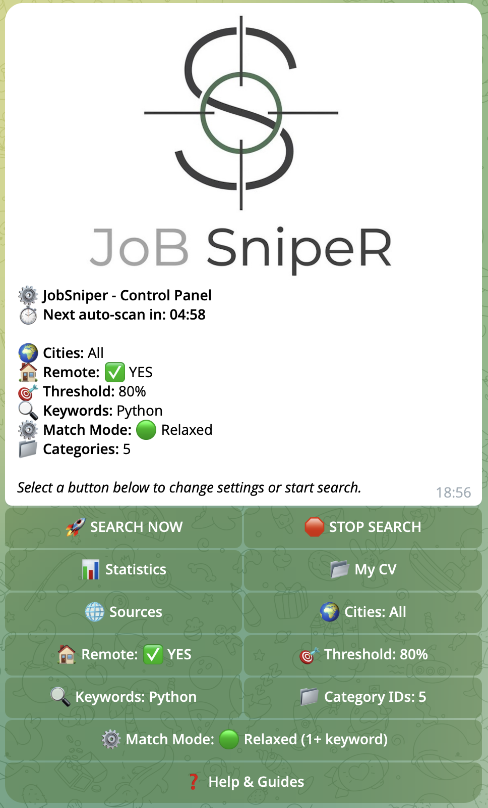
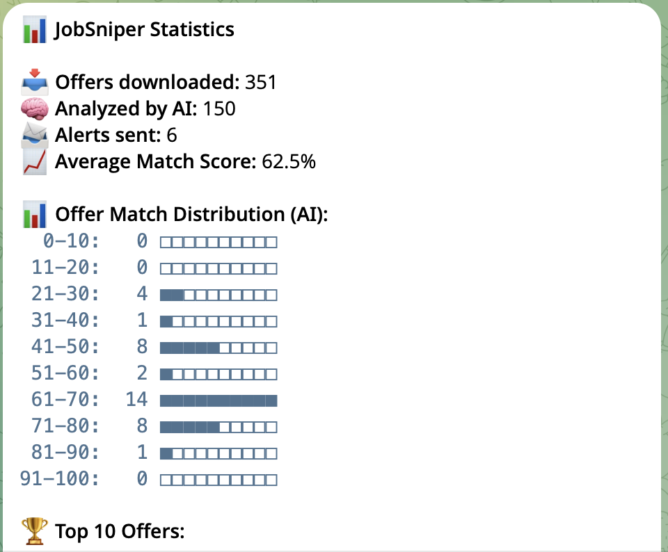
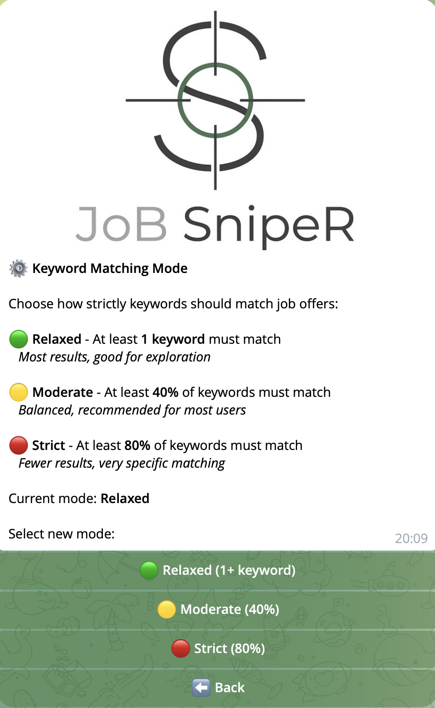
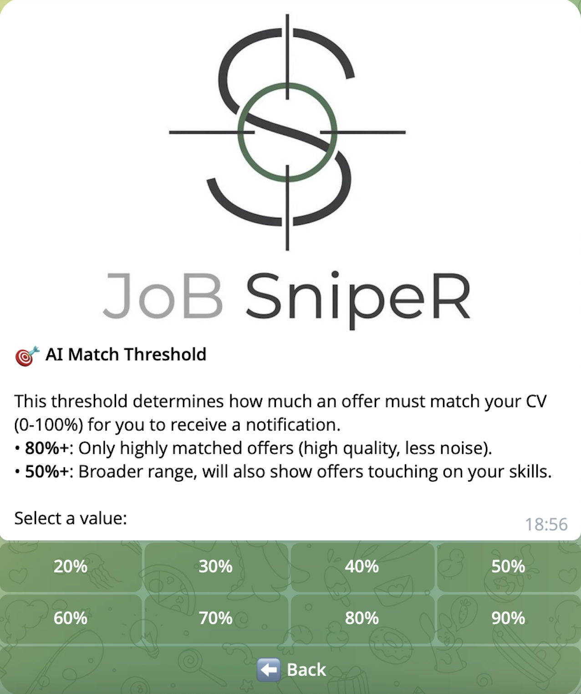

# JobSniper 🎯


**Production-ready AI-powered job monitoring system with intelligent CV matching.**

JobSniper scans **5 job boards** (Just Join IT, RemoteOK, Remotive, Arbeitnow, WeWorkRemotely), parses your CV, and uses **GPT-4o-mini** to score every job offer 0-100%. High matches get instant Telegram notifications with detailed justification.


## 🔄 How It Works

1. **Fetch** — Scans 5 job boards every 5 minutes (configurable)
2. **Store** — Saves all offers to PostgreSQL database
3. **Analyze** — Uses GPT-4o-mini to compare each offer against your CV
4. **Score** — Assigns match score (0-100%) based on skills, experience, and requirements
5. **Notify** — Sends Telegram alert if score exceeds your threshold

All settings can be changed dynamically via Telegram menu - no restart required!

## ✨ Key Features

- **🧠 AI Matching** — GPT-4o-mini understands nuances in tech stacks, seniority, and domain experience
- **📱 Telegram Control Panel** — Full UI for managing filters, CV, and triggering searches
- **🌍 Multi-Source** — Just Join IT, RemoteOK, Remotive, Arbeitnow, WeWorkRemotely
- **⚡ Real-time Alerts** — Instant Telegram notifications for high-match offers
- **📊 Monitoring** — Prometheus metrics, Grafana dashboards, health checks
- **🛡️ Resilience** — Circuit breaker for API protection, graceful error handling

## 🏗️ Tech Stack

| Category | Technology |
|----------|------------|
| **Runtime** | Python 3.11+ with async/await |
| **Database** | PostgreSQL 14+ (SQLAlchemy 2.0 + AsyncPG) |
| **Cache** | Redis 7+ |
| **AI** | OpenAI GPT-4o-mini |
| **Notifications** | Telegram Bot API |
| **Monitoring** | Prometheus + Grafana |
| **Deployment** | Docker Compose |

## 🚀 Quick Start

### Prerequisites

- Docker & Docker Compose
- OpenAI API key
- Telegram Bot (token + chat ID)

### Installation

```bash
# Clone repository
git clone https://github.com/paradoxlabdev/jobsniper-bot.git
cd jobsniper-bot

# Configure environment
cp .env.example .env
# Edit .env and add your API keys

# Add your CV
mkdir -p data
cp /path/to/your/cv.pdf data/cv.pdf

# Start all services
docker-compose up -d
```

### Health Check

```bash
curl http://localhost:8080/health
```

## 🎮 Telegram Control Panel

Type `/start` in Telegram to access the interactive control panel.

### Text Commands

| Command | Description |
|---------|-------------|
| `/start` | Open control panel (main menu) |
| `/help` | Show AI explanation and feature guide |
| `/stats` | View work statistics |
| `/mycv` | View your CV settings |
| `/reset` | Force full re-analysis of all offers |

### Menu Functions

| Function | Description |
|----------|-------------|
| 🚀 **SEARCH NOW** | Trigger immediate scan |
| 🛑 **STOP SEARCH** | Stop automatic scanning |
| 📊 **Statistics** | View performance metrics |
| 📂 **My CV** | View, upload, or delete CV |
| 🌐 **Sources** | Enable/disable job boards (5 sources) |
| 🌍 **Cities** | Set preferred locations |
| 🏠 **Remote** | Toggle remote-only filter |
| 🎯 **Threshold** | Adjust AI strictness (0-100) |
| 🔍 **Keywords** | Update search keywords |
| 📁 **Category IDs** | Change Just Join IT category IDs |
| ⚙️ **Match Mode** | Set keyword matching (Relaxed/Moderate/Strict) |

### Screenshots

<div align="center">
  <table>
    <tr>
      <td align="center">
        
        <p><em>Interactive Control Panel</em></p>
      </td>
      <td align="center">
        
        <p><em>Performance Statistics</em></p>
      </td>
    </tr>
    <tr>
      <td align="center">
        
        <p><em>AI Matching Results</em></p>
      </td>
      <td align="center">
        
        <p><em>Threshold Configuration</em></p>
      </td>
    </tr>
  </table>
</div>

## 📊 Monitoring

### Health Checks

| Endpoint | Description |
|----------|-------------|
| `http://localhost:8080/health` | Main health check |
| `http://localhost:8080/health/db` | Database status |
| `http://localhost:8080/health/redis` | Redis status |
| `http://localhost:9090` | Prometheus |
| `http://localhost:3001` | Grafana (admin/admin) |

### Grafana Dashboard

<div align="center">
  
  <p><em>Real-time monitoring with health metrics, response times, and circuit breaker status</em></p>
</div>

## ⚙️ Configuration

### Environment Variables

| Variable | Description | Default |
|----------|-------------|---------|
| `OPENAI_API_KEY` | OpenAI API key | **Required** |
| `TELEGRAM_BOT_TOKEN` | Telegram bot token | **Required** |
| `TELEGRAM_CHAT_ID` | Telegram chat ID | **Required** |
| `POSTGRES_PASSWORD` | Database password | **Required** |
| `MATCH_THRESHOLD` | Minimum score for notification | 80 |
| `OPENAI_MODEL` | OpenAI model | gpt-4o-mini |

## 🔒 Security Features

- Non-root Docker user
- Resource limits for all containers
- Network isolation (DB/Redis only accessible from Docker network)
- Health checks with automatic container recovery
- Circuit breaker for API protection

## 📁 Project Structure

```
JobSniper/
├── core/              # Config, database, logger, circuit breaker
├── models/            # SQLAlchemy 2.0 models
├── services/          # Fetcher, matcher, notification, storage
├── tests/             # Test suite
├── scripts/           # Utility scripts
├── docs/              # Documentation
├── docker-compose.yml # Full stack orchestration
└── main.py            # Main orchestrator
```

## 🧪 Production Features

- ✅ Deep health checks (DB, Redis, CV, circuit breaker)
- ✅ Prometheus metrics & Grafana dashboards
- ✅ Circuit breaker for resilient API calls
- ✅ Docker hardening (resource limits, security, logging)
- ✅ Graceful degradation
- ✅ Exponential backoff with jitter

## 📝 License

MIT

## 👤 Author

**paradoxlab.dev**

---

**Version:** 2.0.0  
**Last Updated:** 2025
